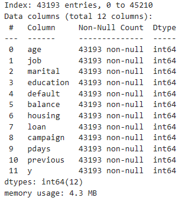

# comparing-classifiers
This is a classifier comparison exercise. The provided dataset contains information results of multiple marketing campaigns from a Portuguese banking institution.

# The Dataset
The given data contains over 45k entries and 15 features. This is how it looks like before data preparation:

# Data Preparation
To prepare the dataset for modeling, I looked at each column with object-type data. Most could be turned into binary, but I had to make some choices based on assumptions to turn other columns into numeric data (marital status and job specifically). Additionally, there was a set of features (contact, day, month, duration) that were related to each other and couldn't be turned into a single numerical column. These were removed, alongside the 'poutcome' column which consisted of 81% unknown values.

After mapping the string values to numeric values for each column that required it, I proceeded to remove all rows with unknown values. This is how the data looks after the preparation stage:

# Testing

Once the data was ready, it was split into training and test sets with a default test size of 0.3. These were used to train four different classifiers: LogisticRegression, KNearestNeighbors, SVM and DecisionTree.
Training (or fit) times were measured, alongside training and test set accuracy scores.

# Findings

All test results were compiled into this dataframe:

PC specs: CPU Intel Core i5-1140 @ 2.6 GHz, 16GB RAM

At first glance, we can see that the LogisticRegression classifier and the SVM classifier took way longer to fit the training data. Test set accuracy was mostly similar, with the DecisionTree classifier falling a bit behind from the rest.
To help better visualize the balance in between fit times and test set accuracy, I used a scatterplot:

Using this, we can easily see that the KNearestNeighbors classifier is the best classifier for this data. I takes almost no time to train, while taking a minimal hit when it comes to test set accuracy.

